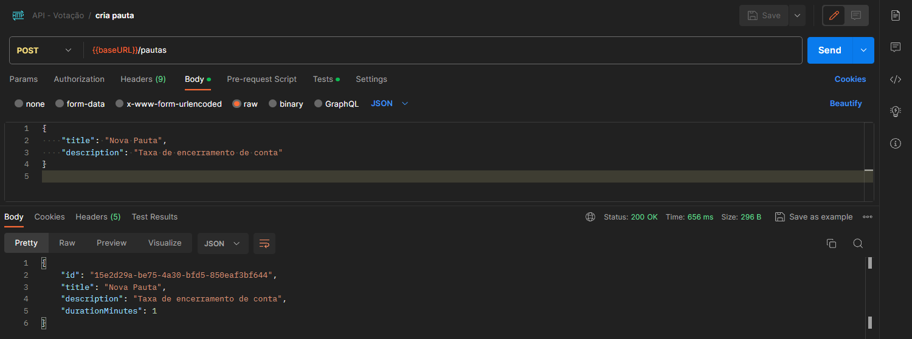
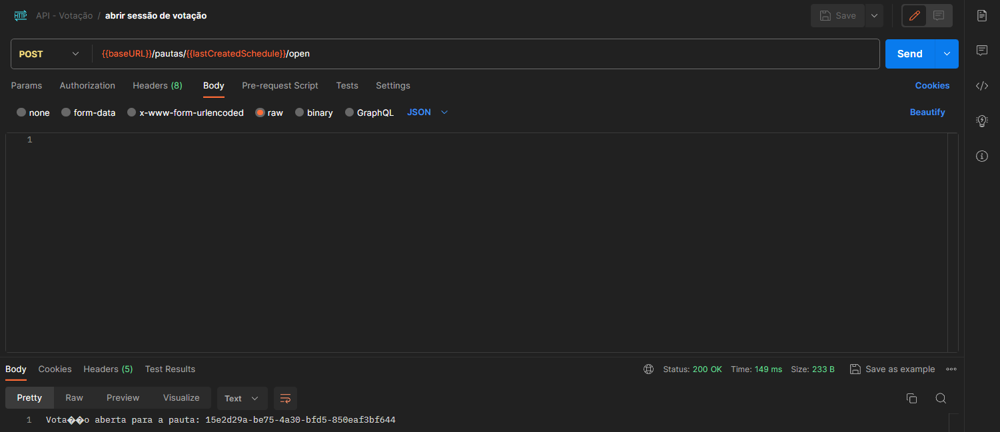
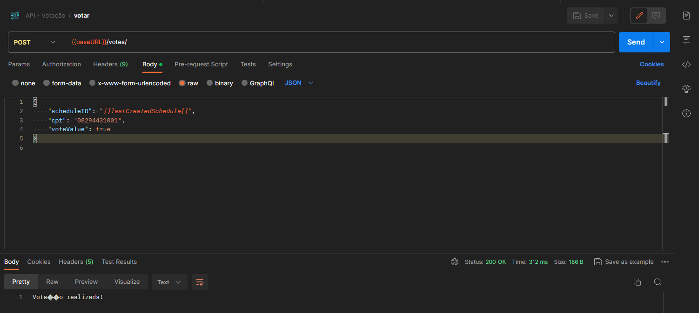
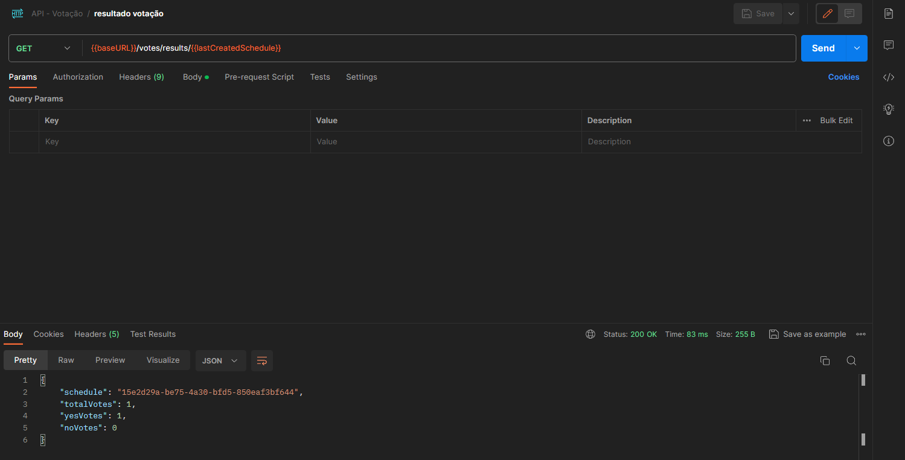
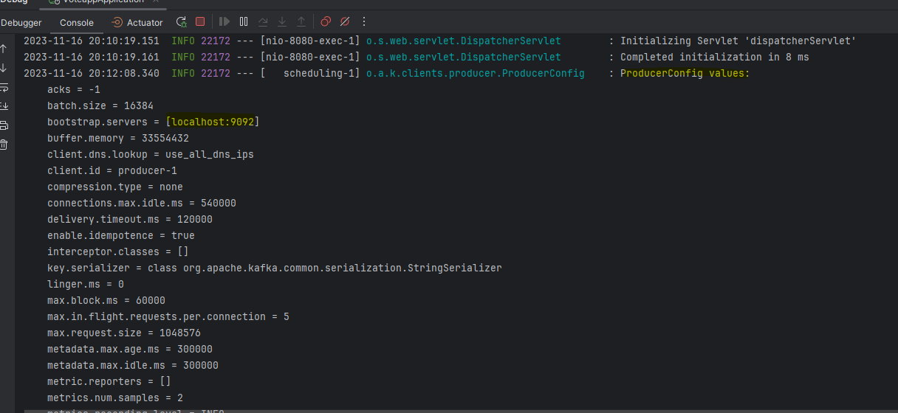

# Projeto de Votação

## Stack de Tecnologia

- Java 11
- Spring Boot 2.7.17
- Spring Data JPA
- H2 Database
- Lombok
- Spring Kafka
- JaCoCo para cobertura de testes

## Configuração

Este projeto é configurado com Gradle. As principais dependências incluem Spring Boot,Spring Data JPA para persistência de dados, 
H2 como banco de dados em memória mas como especificado foi configurado para NÃO apagar os dados na inicialização do projeto,
Lombok para reduzir o boilerplate de código, Kafka para comunicação assincrona entre serviços e JaCoCo para análise de cobertura de testes.

## Executando o Projeto

Para executar o projeto, use o seguinte comando no terminal:

```bash
./gradlew bootRun
```
Isso irá iniciar a aplicação na porta padrão do Spring Boot (8080). Acesse a aplicação via http://localhost:8080.


## Executando os Testes
Para executar os testes do projeto, utilize o comando:
```bash
./gradlew test
```
Este comando irá executar todos os testes unitários e de integração configurados no projeto.

## Gerando o Relatório de Cobertura de Testes com JaCoCo
Para gerar o relatório de cobertura de testes com JaCoCo, execute:
```bash
./gradlew jacocoTestReport
```

## Verificação da Cobertura de Testes
Para verificar se a cobertura de testes atinge o limite mínimo estabelecido (20% neste projeto), execute:
Não é a porcentagem ideal, o certo é cobertura de pelo menos 80% mas neste projeto foi incluido testes apenas como exemplo de um projeto real.
```bash
./gradlew check
```
Este comando irá falhar se a cobertura de testes estiver abaixo do limite especificado.


# Evidências de Teste
Arquivo collection/env para import no postman pode ser encontrado no projeto junto com arquivo docker compose para subir o kafka localmente.
```bash
LOCAL - API Votação.postman_environment.json
API - Votação.postman_collection.json

docker-compose.yml
```
Criação de Pauta


Abertura de Sessão


Votação


Consulta de resultado


Produção de mensagem no Kafka

